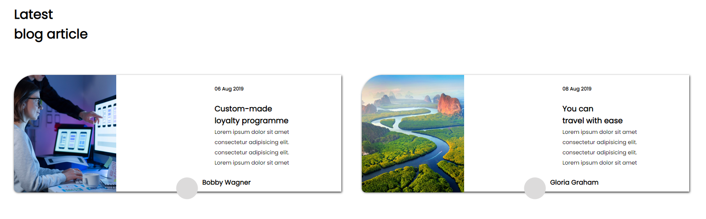
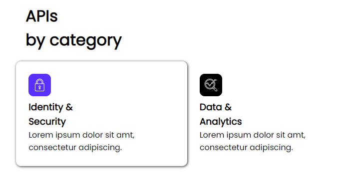

# Developer Landing Page

Here, I have created a website for a Developer's Landing page. 

## Tech stack used
> - HTML 
> - CSS

This website basically shows the Developer's

> - Skills
> - Learning and work experience
> - Companies that he worked for
> - Sample projects
> - Some APIs which he created
> - Social Media links

## The developer is fond of coding and he shares his learning and experiences through his blog articles, which are linked inside the website.

> ## Blogs - 



## The developer has also focoused on his expertise in APIs, as he tells us about the importance of using them and shares some often used APIs created by him.

> ## APIs - 



## There is a Download Now feature on the bottom of the website, which when clicked will download the lastest version of the software for you. 

OR

### You could directly share the Download Link on your email via the ``` Enter Email``` option on the bottom right.


###  At the end, you will find some usefull social-media links and also a ```Help``` button to get in touch with us.


